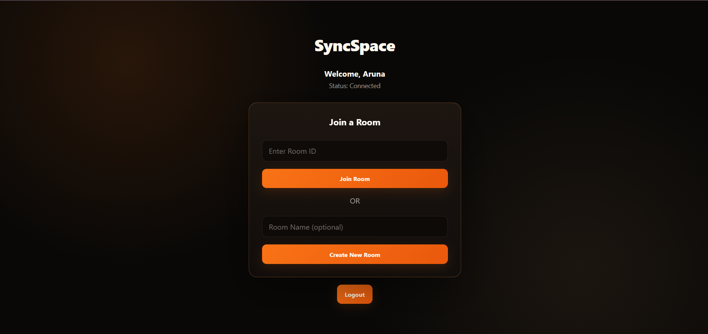

# SyncSpace

A real-time collaborative code workspace that allows authenticated users to create and join rooms, manage individual member workspaces, and exchange code updates in real time.

## Project Overview

SyncSpace is a full-stack collaborative code editor designed around room-based development.

Users can create a room, share its Room ID with other users, and collaborate within the same room. Every member has an independent workspace, allowing each user to maintain their own code while viewing other members' workspaces in read-only mode.

The application combines a React frontend, Node.js and Express backend, MongoDB persistence, and Socket.IO real-time communication.

## Features

### Authentication

* User registration
* User login
* JWT-based authentication
* Persistent authentication state using browser local storage
* Protected room operations

### Room Management

* Create a new room
* Assign a custom room name
* Join an existing room using a Room ID
* Leave a room
* Display current Room ID
* Copy Room ID to clipboard

### Real-Time Collaboration

* Socket.IO-based real-time communication
* Live online user count
* Real-time member updates
* Automatic socket reconnection handling
* Real-time member code updates

### Individual Member Workspaces

Each room member receives an independent workspace.

Example:

```text
Aruna's Workspace
console.log("ARUNA");

Appu's Workspace
console.log("APPU");
```

Updating one member's workspace does not replace another member's workspace.

### Workspace Access Control

* Users can edit only their own workspace
* Other members' workspaces are read-only
* Server validates the user identity before accepting code changes
* Server validates room membership before accepting code changes
* Server validates that the socket belongs to the requested room

### Programming Language Selector

The editor supports language selection for:

* JavaScript
* Python
* Java
* C++
* HTML
* CSS
* JSON

The selected language changes Monaco Editor syntax highlighting for the active workspace.

### Code Editor

SyncSpace uses Monaco Editor and provides:

* Syntax highlighting
* Read-only mode for other members
* Automatic layout
* Smooth scrolling
* Minimap disabled for a cleaner workspace
* Editor padding and responsive layout

### Notifications

Sonner provides in-app toast notifications for actions such as:

* Login success
* Registration success
* Room creation
* Room joining
* Room leaving
* Room ID copied
* Language changes
* Validation errors
* Operation errors

## Architecture

```text
                    +----------------------+
                    |       Browser        |
                    |    React Frontend    |
                    +----------+-----------+
                               |
                +--------------+--------------+
                |                             |
                | REST API                    | Socket.IO
                |                             |
                v                             v
        +---------------+             +---------------+
        |    Express    |             |   Socket.IO   |
        |    Backend    |             | Real-Time     |
        +-------+-------+             +-------+-------+
                |                             |
                +-------------+---------------+
                              |
                              v
                       +-------------+
                       |   MongoDB   |
                       | Users/Rooms |
                       +-------------+
```

### Application Flow

```text
User
 |
 v
React Frontend
 |
 +---- REST API -----------------> Express
 |                                    |
 |                                    v
 |                                 MongoDB
 |
 +---- Socket.IO ----------------> Socket Server
                                      |
                                      v
                               Room Participants
```

## Tech Stack

### Frontend

| Technology       | Purpose                                |
| ---------------- | -------------------------------------- |
| React            | User interface                         |
| Vite             | Frontend development and build tooling |
| Monaco Editor    | Code editor                            |
| Axios            | REST API communication                 |
| Socket.IO Client | Real-time communication                |
| Sonner           | Toast notifications                    |
| CSS              | Responsive application styling         |

### Backend

| Technology | Purpose                   |
| ---------- | ------------------------- |
| Node.js    | Backend runtime           |
| Express    | REST API                  |
| Socket.IO  | Real-time communication   |
| MongoDB    | Data persistence          |
| Mongoose   | MongoDB object modeling   |
| JWT        | Authentication            |
| bcryptjs   | Password hashing          |
| dotenv     | Environment configuration |
| Nodemon    | Development workflow      |

### Additional Libraries

| Technology  | Purpose                                                                   |
| ----------- | ------------------------------------------------------------------------- |
| Yjs         | Collaborative data foundation / future real-time document synchronization |
| y-websocket | Yjs WebSocket support                                                     |

## Prerequisites

Before running the application, install:

* Node.js
* npm
* MongoDB or a MongoDB Atlas account
* Git
* Visual Studio Code or another code editor

Verify Node.js:

```bash
node --version
```

Verify npm:

```bash
npm --version
```

## Project Structure

```text
SyncSpace/
│
├── client/
│   ├── src/
│   │   ├── App.jsx
│   │   ├── App.css
│   │   └── socket.js
│   │
│   ├── package.json
│   └── ...
│
├── server/
│   ├── config/
│   │   └── db.js
│   │
│   ├── controllers/
│   │   └── roomController.js
│   │
│   ├── models/
│   │   └── Room.js
│   │
│   ├── routes/
│   │   └── ...
│   │
│   ├── app.js
│   ├── server.js
│   ├── package.json
│   └── .env
│
├── docs/
│   └── screenshots/
│
├── .gitignore
└── README.md
```

## Installation

Clone the repository:

```bash
git clone https://github.com/Aruna45-star/SyncSpace.git
```

Move into the project:

```bash
cd SyncSpace
```

### Install frontend dependencies

```bash
cd client
npm install
```

### Install backend dependencies

Open another terminal:

```bash
cd server
npm install
```

## Environment Variables

Create a `.env` file inside the `server` directory.

Example:

```env
PORT=5000
MONGO_URI=your_mongodb_connection_string
JWT_SECRET=your_secure_jwt_secret
```

### Environment Variable Description

| Variable     | Description                        |
| ------------ | ---------------------------------- |
| `PORT`       | Backend server port                |
| `MONGO_URI`  | MongoDB connection string          |
| `JWT_SECRET` | Secret used for JWT authentication |

Do not commit real credentials or secrets to Git.

## Running the Frontend

Open a terminal:

```bash
cd SyncSpace/client
npm run dev
```

Vite will display the local development URL in the terminal.

Open that URL in your browser.

## Running the Backend

Open a separate terminal:

```bash
cd SyncSpace/server
npm run dev
```

The backend runs using Nodemon and listens on the configured port.

Default port:

```text
5000
```

## How to Use

### 1. Register

Create an account with:

```text
Name
Email
Password
```

### 2. Login

Use the registered credentials.

### 3. Create a Room

Enter an optional room name and select:

```text
Create New Room
```

A Room ID is generated for the room.

### 4. Share the Room ID

Use the:

```text
Copy Room ID
```

button and share the Room ID with another registered user.

### 5. Join the Room

The other user logs in and enters the Room ID in:

```text
Enter Room ID
```

Then select:

```text
Join Room
```

### 6. Use Member Workspaces

Every room member has a separate workspace.

For example:

```text
Aruna's Workspace

console.log("ARUNA");
```

and:

```text
Appu's Workspace

console.log("APPU");
```

### 7. Select a Language

Use the language selector above the editor:

```text
Language
JavaScript
Python
Java
C++
HTML
CSS
JSON
```

### 8. Collaborate

Connected users can see room presence and receive member code updates in real time.

## Real-Time Collaboration

SyncSpace uses Socket.IO for real-time communication.

Important Socket.IO events include:

```text
join-room
leave-room
room-users
member-code
room-member-codes
member-code-update
code-change
get-member-code
get-room-member-codes
yjs-update
```

### Collaboration Flow

```text
User A
  |
  | code-change
  v
Socket.IO Server
  |
  +----> MongoDB memberCodes
  |
  +----> User B
          |
          v
   member-code-update
```

The server broadcasts the changed member's identity together with the code so clients can update the correct workspace.

## Member Workspaces

The room stores member-specific code using a structure conceptually similar to:

```text
Room
│
├── Member A
│   └── memberCodes[A]
│
├── Member B
│   └── memberCodes[B]
│
└── Member C
    └── memberCodes[C]
```

This means a room does not use one shared code value as the active source for all users.

Each member maintains a separate workspace.

### Editing Rules

```text
Current User's Workspace
        |
        v
      Editable

Another Member's Workspace
        |
        v
     Read-only
```

## Security

SyncSpace implements basic server-side workspace protection.

Before accepting a code update, the server verifies:

1. A Room ID exists.
2. A user ID exists.
3. The socket has an associated user identity.
4. The requested user ID matches the socket user ID.
5. The socket is currently inside the requested room.
6. The user belongs to the room.
7. The code is stored only under that user's member-specific workspace.

This prevents a client from simply sending another member's user ID to modify that member's workspace.

### Authentication Security

* Passwords are hashed with bcryptjs.
* Authentication uses JWT tokens.
* Protected API requests use bearer authorization.
* Sensitive environment variables are kept outside source control.

> The current security model provides workspace authorization and isolation. It is not intended to replace a full production security review.

## Screenshots

Project screenshots can be stored under:

```text
docs/screenshots/
```

Recommended screenshots:

```text
docs/screenshots/login.png
docs/screenshots/room.png
docs/screenshots/member-workspaces.png
docs/screenshots/language-selector.png
docs/screenshots/toast-notifications.png
```

Add them to this section using Markdown:

```md
### Login



### Room Workspace


### Member Workspaces


### Language Selector


### Toast Notifications


```

## Development and Testing

For local development, run the frontend and backend in separate terminals.

### Terminal 1

```bash
cd SyncSpace/server
npm run dev
```

### Terminal 2

```bash
cd SyncSpace/client
npm run dev
```

### Multi-User Testing

Use different browser tabs or windows with different accounts.

Example:

```text
Tab 1
User: Aruna

Tab 2
User: Appu
```

Join both users to the same Room ID and verify:

* Online user count
* Room members
* Individual workspaces
* Read-only access
* Code synchronization
* Language selector
* Toast notifications
* Room joining and leaving

### Workspace Isolation Test

Aruna:

```js
console.log("ARUNA FINAL TEST");
```

Appu:

```js
console.log("APPU FINAL TEST");
```

Expected:

```text
Aruna Workspace -> ARUNA FINAL TEST
Appu Workspace  -> APPU FINAL TEST
```

## Current Scope

The current implementation focuses on:

* authentication
* room management
* real-time room presence
* member-specific workspaces
* code synchronization
* workspace access protection
* language selection
* professional notifications
* responsive developer-focused UI

The current system does not claim full CRDT or operational-transformation based same-document merging.

Yjs-related dependencies and socket event infrastructure are present for potential future deeper collaborative-document synchronization.

## Future Enhancements

Planned or potential improvements include:

* Full Yjs document synchronization
* Persistent language preferences
* Multi-file workspace support
* File explorer
* Room owner and moderator roles
* Cursor presence
* Selection sharing
* Typing indicators
* Collaborative terminal
* Secure code execution
* Improved conflict resolution
* Automated frontend and backend tests
* CI/CD pipeline
* Production deployment
* Monitoring and logging
* Rate limiting and stronger API security controls

## GitHub Repository

Repository:

https://github.com/Aruna45-star/SyncSpace

## License

This project currently does not declare a formal open-source license.

Add a license such as MIT only after the project's licensing decision has been finalized.
